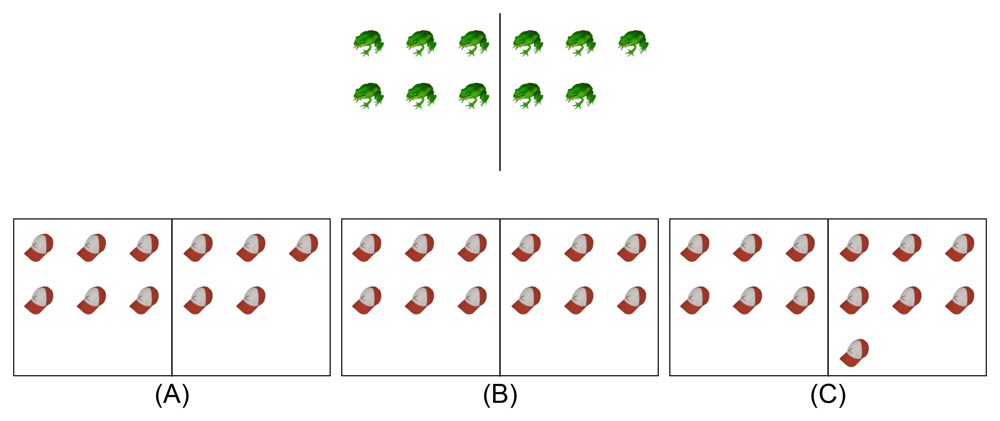
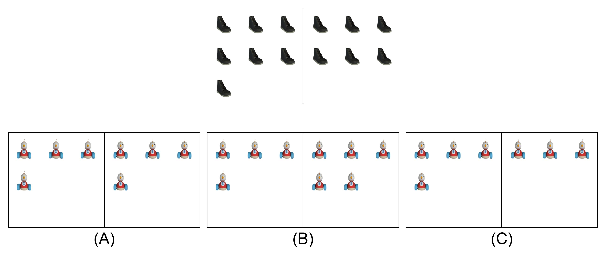
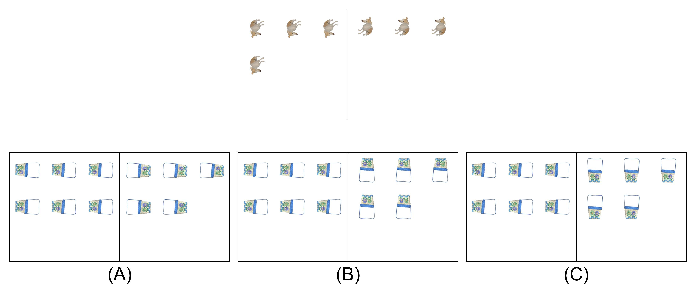

# KiVA: Kid-inspired Visual Analogies

# News
KiVA will debut as a challenge at Google DeepMind’s Third Perception Challenge at ICCV 2025, see [challenge website](https://kiva-challenge.github.io/).

# Overview
[KiVA: Kid-inspired visual analogies ](https://arxiv.org/abs/2407.17773) is a new image‐based multimodal benchmark, grounded in developmental psychology, that uses over simple, intuitive transformations of everyday objects to probe visual analogical reasoning. Inspired by tasks even young children can solve, KiVA evaluates a model’s ability to detect what changed (e.g., size, number, orientation) and apply that abstract rule to novel scenarios. By directly comparing large multimodal models to preschoolers and adults, KiVA sheds light on machines’ capabilities in relation-based generalization and abstract reasoning. 

In this repository, you will find:
* A detailed description of the data and annotations in the KiVA challenge with download links
* Dummy baseline showcasing how to evaluate models in the challenge 

# Data and annotations
The KiVA dataset can be downloaded as zip files containing:
* annotations in JSON format
* images as jpg files

## Download Full Dataset Splits

| Task                      | Split  | Images | Annotations |
|---------------------------|--------|--------|-------------|
| All Tasks                 | Train  |  [train_images.zip (183.7MB)](https://storage.googleapis.com/kiva-challenge/train.zip)      |  [train_annotations (json)](https://storage.googleapis.com/kiva-key/train.json)   |
| All Tasks                 | Valid  |  [validation_images.zip (356.8MB)](https://storage.googleapis.com/kiva-challenge/validation.zip)      |  [validation_annotations (json)](https://storage.googleapis.com/kiva-key/validation.json)    |
| All Tasks                 | Test  |  [test_images.zip (366.2MB)](https://storage.googleapis.com/kiva-challenge/test.zip)      |  [test_annotations will not be publicly released]   |

Each image in the dataset denotes an individual trial.

## Benchmark categorization and evaluation
| Level                          | Difficulty |Transformation(s) involved                |
|--------------------------------|------------|------------------------------------------|
| KiVA                           |   Easy     |Rotation, Reflection, Resizing, Counting  |
| KiVA-functions                 |   Moderate |Rotation, Reflection, Resizing, Counting  |
| KiVA-functions-compositionality|  Difficult |Rotation & Resizing, Rotation & Counting, Reflection & Resizing, Reflection & Counting, Resizing & Counting  |

All categories above will be evaluated by top-1 accuracy.

Click on the images below to see an example from each level of difficulty.

|KiVA example|KiVA-functions example|KiVA-functions-compositionality example|
|:---:|:---:|:---:|
|  |  |  |
|generalization to novel objects (e.g. rule: 6 new objects decrease by 1 in number) | generalization to novel values of visual features through functional inference (e.g. rule: new number of new objects decrease by 1 in number) | generalization to novel values and combinations of visual features, testing functional and compositional reasoning (e.g. rule: new number and new orientation of new objects decrease by 1 in number and rotate by 180 degrees in orientation) |
## KiVA annotations

**Ground truth annotations (train.json)**

| Field Name                   | Description                                                                   |
|------------------------------|-------------------------------------------------------------------------------|
| level                        | difficulty level: kiva, kiva-functions, kiva-functions-compositionality       |
| transformation_domain        | transformation domain(s) involved                                             |
| concept                      | specific transformation parameter(s)                                          |
| correct                      | correct option                                                                |
| incorrect1                   | an incorrect option                                                           |
| incorrect2                   | another incorrect option                                                      |
| train_object_name            | name of object presented in the training transformation                       |
| test_object_name             | name of object presented in the test transformation                           |
| train_input_value            | the initial value of visual feature of the object in the training transformation|
| train_output_value           | the final value of visual feature of the object in the training transformation|
| test_input_value             | the initial value of visual feature of the object in the test transformation  |
| correct_test_output_value    | the correct final value of visual feature of the object in the test transformation|
| incorrect_test_output_value1 | an incorrect final value of visual feature of the object in the test transformation|
| incorrect_test_output_value2 | another incorrect final value of visual feature of the object in the test transformation|
| seed                         | the seed used to randomly generate the stimuli and options                    |
| index                        | tracks the number of variation within the specific transformation parameter(s)|

# Dummy Baseline: Model Evaluation in the Challenge

We provide a dummy baseline to showcase how models will be evaluated in the challenge. [](https://colab.research.google.com/drive/1DSLTYeoUa72eJBKBjGmQcIdMPRpEIonB?usp=sharing) 

## Feedback and support

If you have any questions, feedback, or require support regarding the KiVA dataset or challenge, please contact us at **kiva.challenge.25@gmail.com**.

## Citing this work

```
@inproceedings{yiu2024kiva,
  title={Kiva: Kid-inspired visual analogies for testing large multimodal models},
  author={Yiu, Eunice and Qraitem, Maan and Majhi, Anisa Noor and Wong, Charlie and Bai, Yutong and Ginosar, Shiry and Gopnik, Alison and Saenko, Kate},
  booktitle={The Thirteenth International Conference on Learning Representations},
  year={2025},
  url={https://openreview.net/forum?id=vNATZfmY6R}
}
```
## License and disclaimer

All software is licensed under the Apache License, Version 2.0 (Apache 2.0);
you may not use this file except in compliance with the Apache 2.0 license.
You may obtain a copy of the Apache 2.0 license at:
https://www.apache.org/licenses/LICENSE-2.0

All other materials are licensed under the Creative Commons Attribution 4.0
International License (CC-BY). You may obtain a copy of the CC-BY license at:
https://creativecommons.org/licenses/by/4.0/legalcode

Unless required by applicable law or agreed to in writing, all software and
materials distributed here under the Apache 2.0 or CC-BY licenses are
distributed on an "AS IS" BASIS, WITHOUT WARRANTIES OR CONDITIONS OF ANY KIND,
either express or implied. See the licenses for the specific language governing
permissions and limitations under those licenses.
